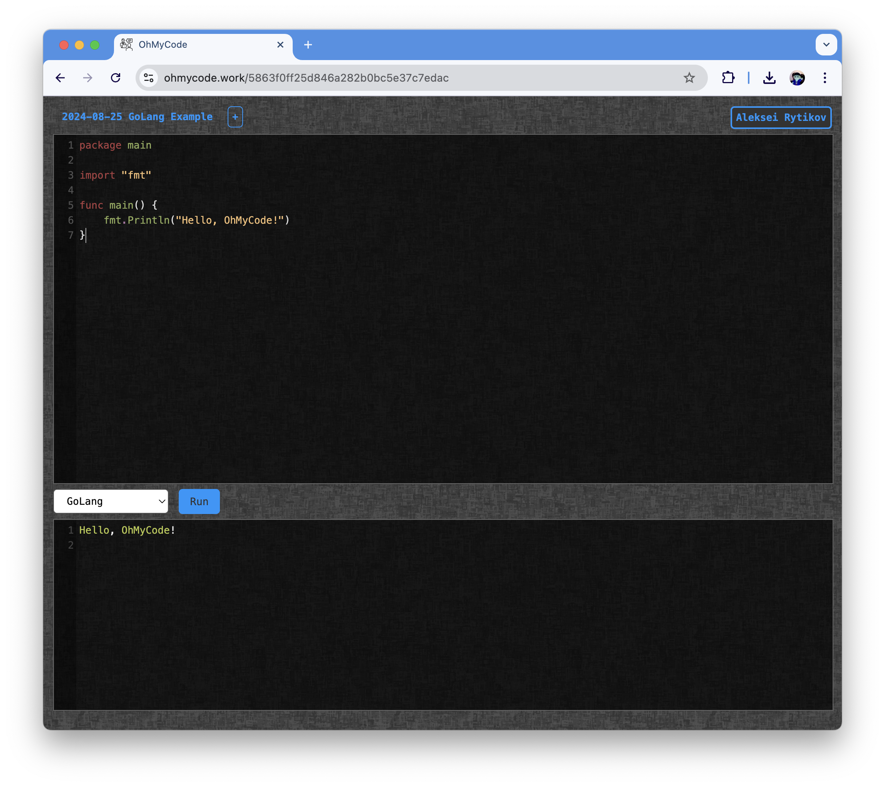

# OhMyCode. Live coding app

A real-time collaborative code editing and execution service.

https://ohmycode.work/

# How it works

1. After landing on the homepage, a new session with a unique ID is automatically created. You can immediately share the URL with others.
2. All code changes are saved instantly and visible to all session participants in real-time.
3. All participants have equal permissions, but only one person can edit the code at a time. When someone starts editing, others are temporarily blocked from making changes until the current editor stops.

# Build and run

1. cd api and run `docker compose up --build --remove-orphans --force-recreate`
2. cd runner and run `docker compose up --build --remove-orphans --force-recreate`