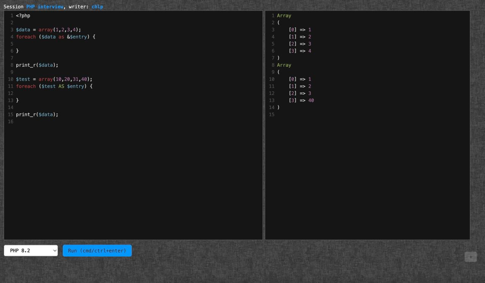

# OhMyCode. Live coding app

https://ohmycode.work/

# Modules
1. API Server
2. Runner
3. Front-end client

## 1. API Server

HTTP API (api/public/action), stores session data (MySQL).

## 2. Runner

Goes to API Server, receives code for execution, executes it, gives result back.

## 3. Front-end client

The only window with a user interface - code editor.

# How it works

At the beginning, the user opens a new meeting page and receives a session ID inside URL. All other users can join the session using the same URL.

Anyone interested in writing code clicks the "Become a Writer" button. Only one user can edit the code at a time.

**Runner** app receives a unique ID upon startup. During the meeting, participants can write down this ID; this helps the runner understand which session requests to prioritize.

After launching, the runner contacts the API with its ID in an attempt to retrieve request. It runs the request and returns the result to the API.

Runner ID you enter remains unseen, so all invited users cannot use it without control.

**Runner** does not have visibility of the session ID when receiving tasks, guaranteeing that it is impossible for strangers to identify the session ID from the runner's side and intrude into your meeting.

Utilize these projects:
* https://codemirror.net/
* https://github.com/kevquirk/simple.css
