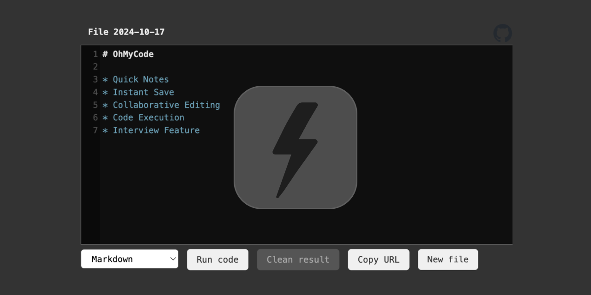

# OhMyCode

* Keep notes
* Write and execute code
* Share with ease
* Collaborate in real-time
* Lightning-fast
* Use public server or deploy in your private network

Try it -> https://ohmycode.work/

# Build and run

1. api:
    * `cd api`
    * `cp api-conf-example.json api-conf.json` and fill
    * `docker compose up --build --remove-orphans --force-recreate`
      or `GOOS=linux GOARCH=amd64 go build -o ohmycode_api` and run binary
2. runner:
    * `cd runner`
    * `cp conf-example.json conf.json` and fill
    * `docker compose up --build --remove-orphans --force-recreate`
3. client `docker compose up --build --remove-orphans --force-recreate`
    * `cd client`
    * `cp public/js/conf-example.json public/js/conf.json` and fill
    * `docker compose up --build --remove-orphans --force-recreate`
